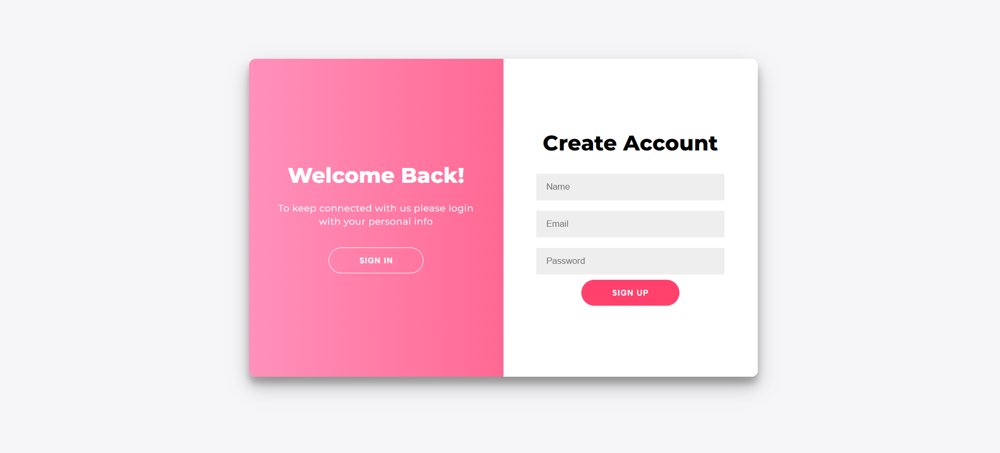
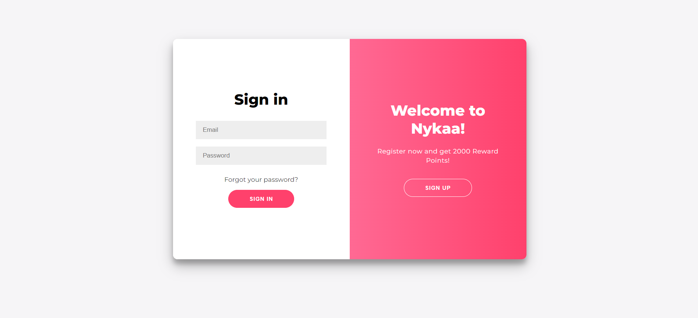
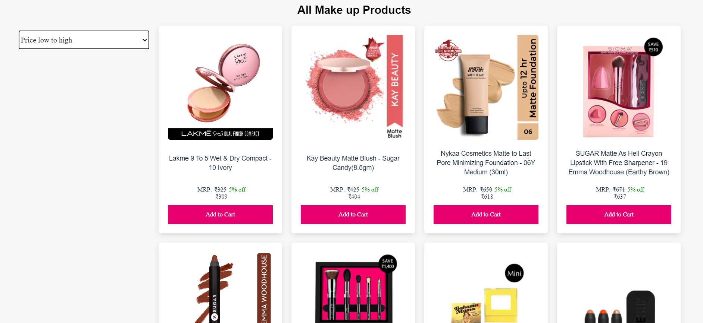
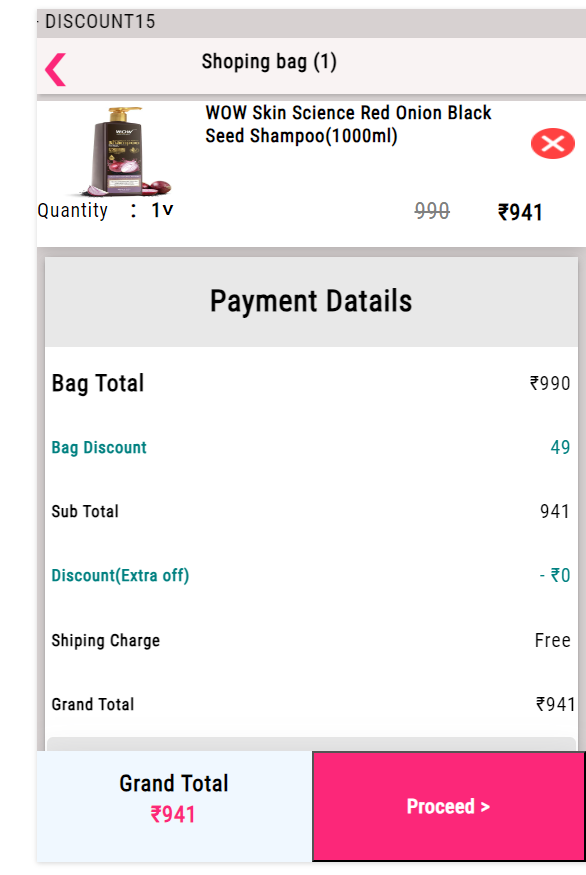
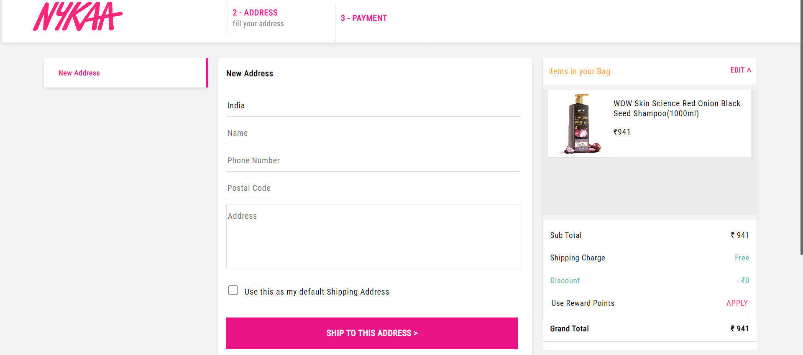
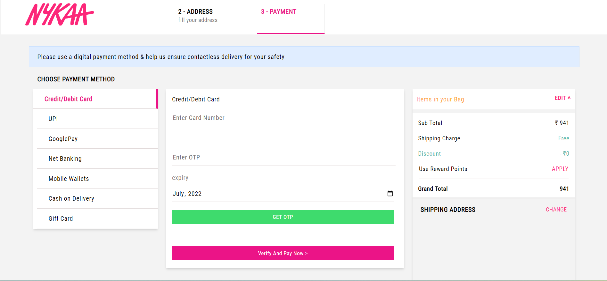
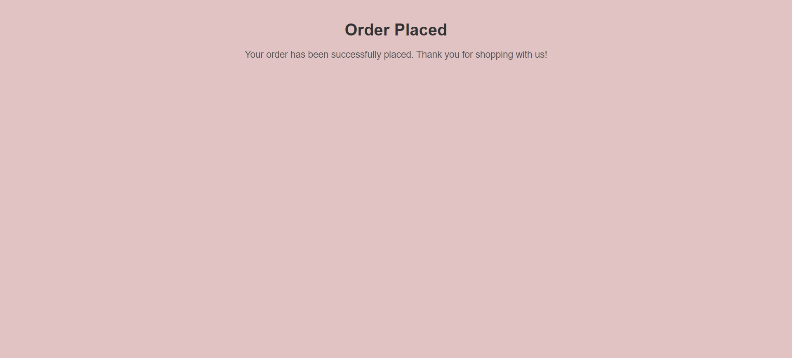

# Nykaa-clone

## Description 
As a 4-member team, we collaborated on the "Nykaa-Clone" project, focusing on developing a user-friendly e-commerce website using web technologies. This experience allowed us to grow as front-end developers, create engaging user interfaces, and work effectively as a team.

### Tech Used
- HTML
- CSS
- Javascript
- Local Storage

### Team Member
-Shubham Deshmukh
- Saloni Goyal
- Shivam Pathak
- Ashwek

# Work Description

## Home Page

## Signup Page

## Login Page

## Product Page

## Cart Page

## Checkout page

## Payment Page

## Order success page

